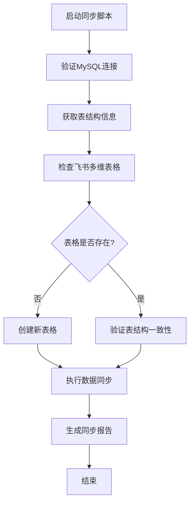

# MySQL到飞书多维表格同步系统 - 产品需求文档

## 1. 产品概述

本项目旨在开发一个Python脚本，实现MySQL数据库表数据到飞书多维表格的自动同步功能。系统将提供安全可靠的数据传输通道，支持表结构映射、增量同步和实时监控。

该产品解决了企业在数据协作场景中，需要将数据库数据实时同步到飞书多维表格进行团队协作和数据分析的需求。通过自动化同步机制，提高数据一致性和工作效率。

## 2. 核心功能

### 2.1 用户角色

| 角色 | 使用方式 | 核心权限 |
|------|----------|----------|
| 数据管理员 | 命令行执行脚本 | 配置数据库连接、执行同步任务、查看同步日志 |
| 系统运维员 | 定时任务调度 | 监控同步状态、处理异常情况、维护系统运行 |

### 2.2 功能模块

本系统包含以下核心功能模块：
1. **数据库连接模块**：安全连接MySQL数据库，获取表结构和数据
2. **飞书API集成模块**：通过Base OpenSDK操作飞书多维表格
3. **数据同步引擎**：执行数据同步逻辑，支持增量更新
4. **监控日志模块**：记录同步过程，提供进度反馈和错误追踪

### 2.3 页面详情

| 模块名称 | 功能名称 | 功能描述 |
|----------|----------|----------|
| 数据库连接模块 | MySQL连接管理 | 建立安全的数据库连接，支持连接池管理。验证连接参数：地址(rm-zf81e68a31gsqv1c7zo.mysql.kualalumpur.rds.aliyuncs.com)、端口(3306)、用户名(writer_readonly)、密码验证 |
| 数据库连接模块 | 表结构解析 | 自动获取MySQL表结构信息，包括字段名、数据类型、约束条件等。支持多表批量解析 |
| 飞书API集成模块 | 多维表格创建 | 基于MySQL表结构在飞书中创建对应的多维表格。如果表已存在则跳过创建，支持表名映射配置 |
| 飞书API集成模块 | 字段类型映射 | 将MySQL字段类型转换为飞书多维表格支持的字段类型。处理数据类型兼容性问题 |
| 数据同步引擎 | 全量同步 | 首次同步时将MySQL表中所有数据导入到飞书多维表格。支持大数据量分批处理 |
| 数据同步引擎 | 增量同步 | 基于时间戳或版本号实现增量数据同步。对比数据变化，执行插入、更新、删除操作 |
| 数据同步引擎 | 冲突处理 | 处理数据同步过程中的冲突情况。如果记录已存在则更新，不存在则创建新记录 |
| 监控日志模块 | 进度监控 | 实时显示同步进度，包括已处理记录数、剩余记录数、预计完成时间 |
| 监控日志模块 | 错误处理 | 捕获并记录同步过程中的异常和错误。提供详细的错误信息和解决建议 |
| 监控日志模块 | 统计报告 | 生成同步结果统计报告，包括成功记录数、失败记录数、耗时统计等 |

## 3. 核心流程

### 主要操作流程：

1. **初始化阶段**：验证MySQL连接参数，建立数据库连接
2. **表结构分析**：获取MySQL表结构信息，进行字段类型映射
3. **飞书表格准备**：检查飞书多维表格是否存在，不存在则创建
4. **数据同步执行**：根据同步策略执行全量或增量同步
5. **结果反馈**：输出同步统计信息和错误日志

## 4. 用户界面设计

### 4.1 设计风格

- **主色调**：蓝色(#1890FF)作为主色，灰色(#666666)作为辅助色
- **交互风格**：命令行界面，简洁明了的文本输出
- **字体**：等宽字体，便于对齐显示数据和进度信息
- **布局风格**：垂直布局，按执行顺序显示信息
- **图标风格**：使用ASCII字符和颜色编码表示状态（✓成功，✗失败，⚠警告）

### 4.2 界面设计概览

| 模块名称 | 界面元素 | UI设计要求 |
|----------|----------|------------|
| 启动界面 | 欢迎信息和参数验证 | 显示脚本版本信息，验证必要参数。使用蓝色标题，绿色成功提示 |
| 连接状态 | 数据库连接进度 | 实时显示连接状态，使用进度条和状态图标。连接成功显示绿色✓，失败显示红色✗ |
| 同步进度 | 数据处理进度条 | 显示当前处理的表名、记录数量、完成百分比。使用动态进度条和彩色状态指示 |
| 结果统计 | 同步结果汇总 | 表格形式显示各表同步结果，包括成功数、失败数、耗时。使用颜色区分成功和失败状态 |
| 错误日志 | 异常信息展示 | 详细显示错误信息和堆栈跟踪。使用红色高亮错误，黄色显示警告信息 |

### 4.3 响应性设计

本系统为命令行应用，主要考虑终端兼容性。支持不同终端窗口大小的自适应显示，确保在标准80字符宽度的终端中正常显示。支持颜色输出的终端将显示彩色状态信息，不支持颜色的终端将使用符号标识状态。