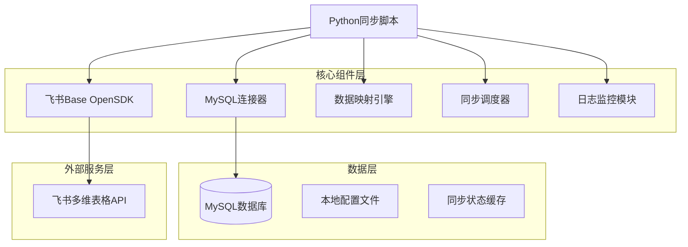
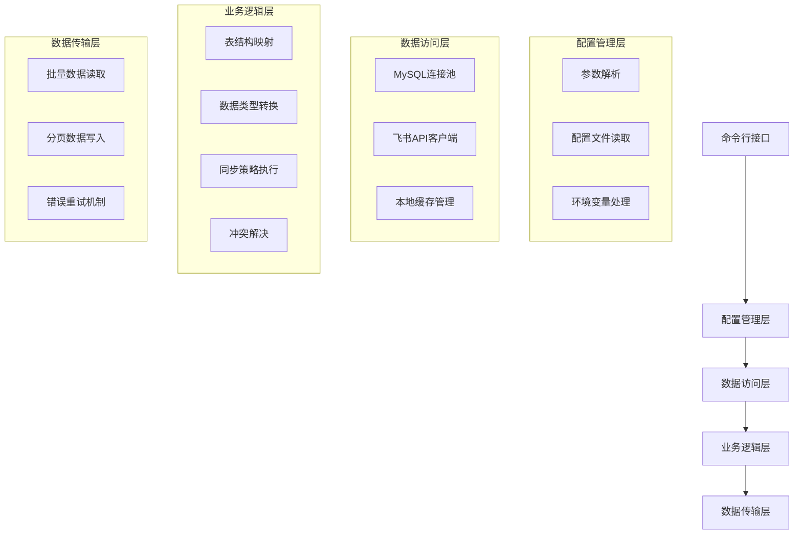
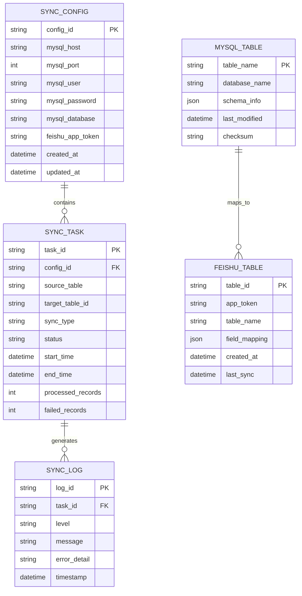

# MySQL到飞书多维表格同步系统 - 技术架构文档

## 1. 架构设计



## 2. 技术描述

- Frontend: 无（命令行应用）
- Backend: Python@3.8+ + PyMySQL + 飞书Base OpenSDK + logging + configparser
- Database: MySQL（数据源）+ 飞书多维表格（目标存储）
- Cache: 内存缓存（同步状态管理）

## 3. 路由定义

本系统为命令行应用，主要功能模块及其调用路径：

| 模块路径 | 功能描述 |
|----------|----------|
| /main.py | 主程序入口，解析命令行参数，初始化各模块 |
| /database/mysql_connector.py | MySQL数据库连接和操作模块 |
| /feishu/base_client.py | 飞书Base OpenSDK封装模块 |
| /sync/data_mapper.py | 数据类型映射和转换模块 |
| /sync/sync_engine.py | 数据同步核心引擎 |
| /utils/logger.py | 日志记录和监控模块 |
| /config/settings.py | 配置管理模块 |

## 4. API定义

### 4.1 核心API

#### MySQL数据库操作API

**获取数据库表列表**
```python
def get_tables(connection) -> List[str]
```

参数:
| 参数名 | 参数类型 | 是否必需 | 描述 |
|--------|----------|----------|------|
| connection | MySQLConnection | true | MySQL数据库连接对象 |

返回:
| 参数名 | 参数类型 | 描述 |
|--------|----------|------|
| tables | List[str] | 数据库表名列表 |

**获取表结构信息**
```python
def get_table_schema(connection, table_name: str) -> Dict
```

参数:
| 参数名 | 参数类型 | 是否必需 | 描述 |
|--------|----------|----------|------|
| connection | MySQLConnection | true | MySQL数据库连接对象 |
| table_name | str | true | 表名 |

返回:
| 参数名 | 参数类型 | 描述 |
|--------|----------|------|
| schema | Dict | 表结构信息，包含字段名、类型、约束等 |

示例:
```json
{
  "table_name": "users",
  "columns": [
    {
      "name": "id",
      "type": "int",
      "nullable": false,
      "primary_key": true
    },
    {
      "name": "username",
      "type": "varchar",
      "length": 50,
      "nullable": false
    }
  ]
}
```

#### 飞书多维表格操作API

**创建多维表格**
```python
def create_bitable(app_token: str, table_name: str, fields: List[Dict]) -> str
```

参数:
| 参数名 | 参数类型 | 是否必需 | 描述 |
|--------|----------|----------|------|
| app_token | str | true | 飞书应用token |
| table_name | str | true | 表格名称 |
| fields | List[Dict] | true | 字段定义列表 |

返回:
| 参数名 | 参数类型 | 描述 |
|--------|----------|------|
| table_id | str | 创建的表格ID |

**批量插入记录**
```python
def batch_create_records(app_token: str, table_id: str, records: List[Dict]) -> Dict
```

参数:
| 参数名 | 参数类型 | 是否必需 | 描述 |
|--------|----------|----------|------|
| app_token | str | true | 飞书应用token |
| table_id | str | true | 表格ID |
| records | List[Dict] | true | 记录数据列表 |

返回:
| 参数名 | 参数类型 | 描述 |
|--------|----------|------|
| result | Dict | 插入结果统计 |

## 5. 服务架构图



## 6. 数据模型

### 6.1 数据模型定义



### 6.2 数据定义语言

#### 同步配置表 (sync_configs)
```sql
-- 创建同步配置表
CREATE TABLE sync_configs (
    config_id VARCHAR(36) PRIMARY KEY DEFAULT (UUID()),
    mysql_host VARCHAR(255) NOT NULL,
    mysql_port INT DEFAULT 3306,
    mysql_user VARCHAR(100) NOT NULL,
    mysql_password VARCHAR(255) NOT NULL,
    mysql_database VARCHAR(100) NOT NULL,
    feishu_app_token VARCHAR(255) NOT NULL,
    created_at TIMESTAMP DEFAULT CURRENT_TIMESTAMP,
    updated_at TIMESTAMP DEFAULT CURRENT_TIMESTAMP ON UPDATE CURRENT_TIMESTAMP
);

-- 创建索引
CREATE INDEX idx_sync_configs_host_db ON sync_configs(mysql_host, mysql_database);

-- 初始化数据
INSERT INTO sync_configs (mysql_host, mysql_port, mysql_user, mysql_password, mysql_database, feishu_app_token)
VALUES ('rm-zf81e68a31gsqv1c7zo.mysql.kualalumpur.rds.aliyuncs.com', 3306, 'writer_readonly', 'c*xZ%BEu2VikL%G', 'default_db', 'your_feishu_app_token');
```

#### 同步任务表 (sync_tasks)
```sql
-- 创建同步任务表
CREATE TABLE sync_tasks (
    task_id VARCHAR(36) PRIMARY KEY DEFAULT (UUID()),
    config_id VARCHAR(36) NOT NULL,
    source_table VARCHAR(100) NOT NULL,
    target_table_id VARCHAR(100),
    sync_type ENUM('full', 'incremental') DEFAULT 'full',
    status ENUM('pending', 'running', 'completed', 'failed') DEFAULT 'pending',
    start_time TIMESTAMP NULL,
    end_time TIMESTAMP NULL,
    processed_records INT DEFAULT 0,
    failed_records INT DEFAULT 0,
    FOREIGN KEY (config_id) REFERENCES sync_configs(config_id)
);

-- 创建索引
CREATE INDEX idx_sync_tasks_config_id ON sync_tasks(config_id);
CREATE INDEX idx_sync_tasks_status ON sync_tasks(status);
CREATE INDEX idx_sync_tasks_start_time ON sync_tasks(start_time DESC);
```

#### 同步日志表 (sync_logs)
```sql
-- 创建同步日志表
CREATE TABLE sync_logs (
    log_id VARCHAR(36) PRIMARY KEY DEFAULT (UUID()),
    task_id VARCHAR(36) NOT NULL,
    level ENUM('DEBUG', 'INFO', 'WARNING', 'ERROR') DEFAULT 'INFO',
    message TEXT NOT NULL,
    error_detail TEXT,
    timestamp TIMESTAMP DEFAULT CURRENT_TIMESTAMP,
    FOREIGN KEY (task_id) REFERENCES sync_tasks(task_id)
);

-- 创建索引
CREATE INDEX idx_sync_logs_task_id ON sync_logs(task_id);
CREATE INDEX idx_sync_logs_level ON sync_logs(level);
CREATE INDEX idx_sync_logs_timestamp ON sync_logs(timestamp DESC);
```